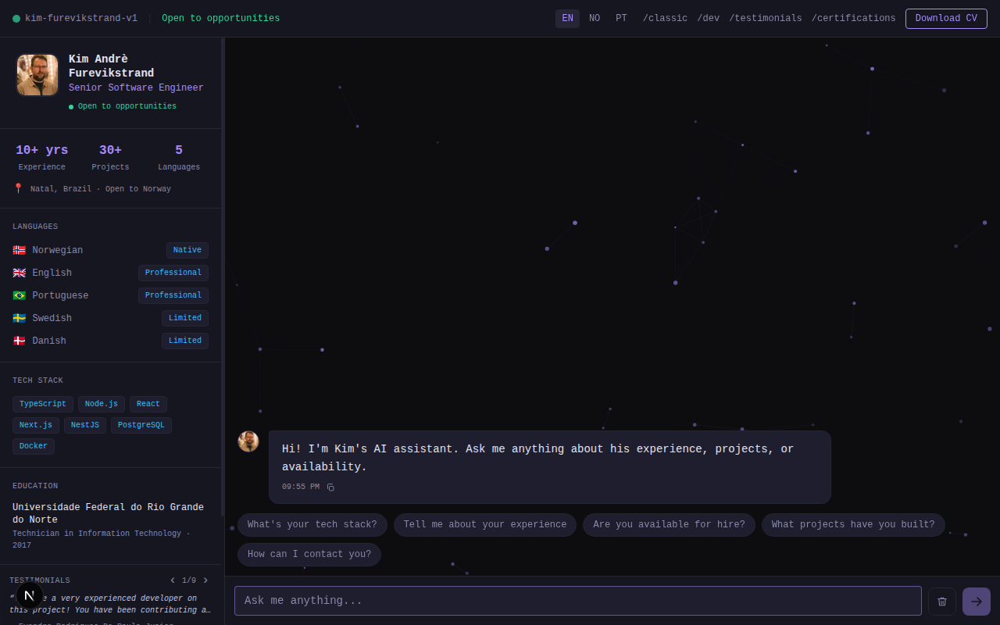

# furevikstrand.cloud

Source for [**furevikstrand.cloud**](https://furevikstrand.cloud) — a single-developer portfolio whose centerpiece is an AI chat assistant that answers questions about Kim Furevikstrand. Trilingual (English / Norsk / Português), keyboard-first, dark theme, mobile-friendly.

Built with Next.js 16 (App Router) + React 19 + Tailwind 4, deployed as a `standalone` Docker image.



## Quick start

```bash
npm install
npm run dev
```

Dev server runs at http://localhost:3000 (Next.js falls through to 3001 if 3000 is taken). With no env vars set, the chat uses the keyword-matcher fallback tier — no API keys required.

## Architecture in brief

`POST /api/chat` is a three-tier pipeline that falls through on failure:

1. **Claude API** (streaming) — when `ANTHROPIC_API_KEY` is set
2. **Ollama** (NDJSON streaming) — when `OLLAMA_HOST` is set
3. **Keyword matcher** in `lib/chat.ts` — pure-TS fuzzy scorer over `data/knowledge.ts`. Always available.

The response carries `X-Reply-Source: claude | ollama | fallback` so the client knows whether to consume a stream or a single string.

See [`CLAUDE.md`](./CLAUDE.md) for the full map: i18n routing skeleton, client-side chat state, analytics, and deploy details.

## Scripts

| Command                           | Purpose                                               |
| --------------------------------- | ----------------------------------------------------- |
| `npm run dev`                     | Next.js dev server (Turbopack)                        |
| `npm run build`                   | Production build (`output: 'standalone'`)             |
| `npm run start`                   | Run the built standalone server                       |
| `npm run lint` / `lint:fix`       | ESLint                                                |
| `npm run format` / `format:check` | Prettier                                              |
| `npm run typecheck`               | `tsc --noEmit`                                        |
| `npm run analyze`                 | Webpack build with bundle analyzer (`.next/analyze/`) |
| `npm run test:e2e`                | Playwright smoke tests on desktop Chrome + Pixel 5    |

## Environment variables

All optional. Missing vars degrade gracefully:

| Variable                       | Purpose                                                | Without it                              |
| ------------------------------ | ------------------------------------------------------ | --------------------------------------- |
| `ANTHROPIC_API_KEY`            | Enables tier 1 (Claude)                                | Tier 1 skipped, falls through           |
| `CLAUDE_MODEL`                 | Override Claude model                                  | Defaults to `claude-haiku-4-5`          |
| `DISABLE_CLAUDE`               | `true` to skip Claude even when the key is set         | Used in CI / tests                      |
| `OLLAMA_HOST`                  | Enables tier 2 (Ollama), e.g. `http://localhost:11434` | Tier 2 skipped                          |
| `OLLAMA_MODEL`                 | Override Ollama model                                  | Defaults to `gemma3:4b`                 |
| `DISABLE_OLLAMA`               | `true` to skip Ollama                                  | Used in CI / tests                      |
| `DATABASE_URL`                 | MySQL for `chat_events` logging                        | Logging silently skipped                |
| `RESEND_API_KEY`               | Contact-form email delivery via Resend                 | Logged to console, form returns success |
| `RESEND_TO_EMAIL`              | Recipient for contact-form messages                    | Required if `RESEND_API_KEY` is set     |
| `NEXT_PUBLIC_PLAUSIBLE_DOMAIN` | Plausible analytics domain (baked in at build time)    | No analytics                            |

## Deploy

The repo ships a 3-stage Alpine Node 20 `Dockerfile` that produces a `standalone` Next.js server on port 3000 with a `/api/health` healthcheck.

```bash
docker build -t furevikstrand-cloud .
docker run -p 3000:3000 \
  -e ANTHROPIC_API_KEY=sk-... \
  furevikstrand-cloud
```

`next.config.ts` sets `output: 'standalone'` for this reason — don't drop it without updating the Dockerfile.

## Project map

```
app/[locale]/        Pages (chat, classic, dev, certifications, testimonials)
app/api/             Routes (chat, contact, health)
components/          UI; chat surface lives in components/chat
context/             ChatProvider — sessionStorage-backed history per locale
data/                Source-of-truth for what the assistant knows
i18n/                Locale union + next-intl routing
messages/{en,no,pt}  UI strings
lib/                 chat (keyword matcher), db, logEvent, rateLimit, session
proxy.ts             next-intl middleware (named `proxy.ts`, not `middleware.ts`)
tests/               Playwright smoke tests
```

## License

No `LICENSE` file — personal portfolio. Content (CV, testimonials, profile copy) belongs to Kim. Code structure and patterns are free to learn from.
